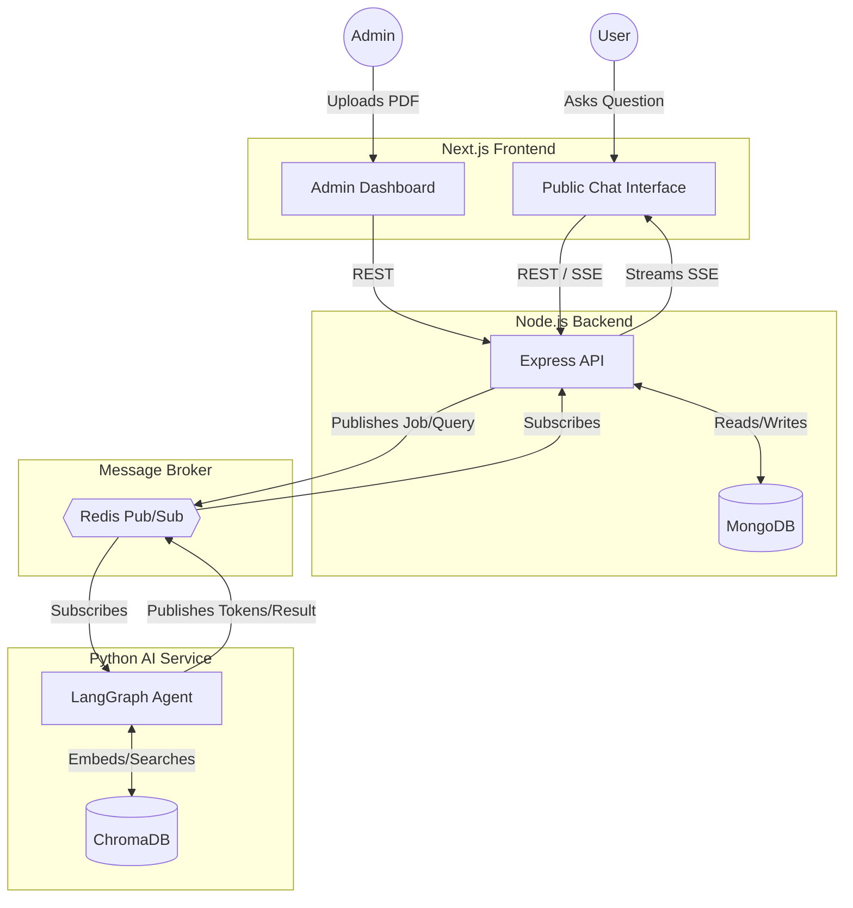

<div align="center">
  <h1>🤖 PDF Knowledge Base AI Chatbot</h1>
  <p><strong>A Microservice RAG System Powered by LangGraph, Redis, and Next.js</strong></p>
</div>

---

## 📖 High-Level Overview

The **PDF Knowledge Base AI Chatbot** is a full-stack, distributed Retrieval-Augmented Generation (RAG) system. It allows administrators to upload PDF documents, which are automatically processed and embedded into a vector database to form a searchable knowledge base. End-users can interact with a public-facing chatbot that answers questions based strictly on the uploaded documents. 

Key features include:
- **Source Citations**: Every answer includes references to the original document and page number.
- **Streaming Responses**: Token-by-token response streaming for a seamless user experience.
- **Suggested Follow-up Questions**: Dynamically generated contextual questions to keep the conversation flowing.
- **Microservice Architecture**: Decoupled frontend, backend, and AI worker, communicating efficiently via Redis Pub/Sub.

## 🏗️ Microservices Architecture

This project strictly adheres to a microservices pattern, ensuring separation of concerns, scalability, and maintainability.

| Service | Technology | Role |
|---------|------------|------|
| **Frontend** | Next.js (App Router), Tailwind CSS, shadcn/ui | Admin panel (upload PDFs, view analytics) & Public Chat UI. |
| **Backend API** | Node.js, Express, TypeScript | Handles auth, file uploads (multer), stores metadata in MongoDB, and orchestrates jobs via Redis. |
| **AI Worker** | Python, FastAPI, LangChain, LangGraph | Processes PDFs, generates embeddings, executes the RAG workflow, and manages ChromaDB. |
| **Databases** | MongoDB, ChromaDB (Vector) | MongoDB stores application state (users, docs, chats). ChromaDB stores vector embeddings. |
| **Message Broker**| Redis Pub/Sub | **The sole communication bridge** between the Node.js backend and Python AI Worker (no direct HTTP). |

### Overall System Flow



## 🚀 Setup Instructions

### Option 1: Quick Start (Docker — Recommended)

1. **Configure Environment Variables**
   ```bash
   cp .env.example .env
   ```
   *At a minimum, set your `OPENAI_API_KEY` for answer generation. Embeddings use a free local HuggingFace model by default.*

2. **Spin Up Containers**
   ```bash
   docker-compose up --build
   ```

3. **Access Services**
   - **Public Chatbot**: [http://localhost:3000/chat](http://localhost:3000/chat)
   - **Admin Panel**: [http://localhost:3000/admin/login](http://localhost:3000/admin/login)
   - **Backend API Health**: [http://localhost:5000/health](http://localhost:5000/health)
   - **AI Service Health**: [http://localhost:8000/health](http://localhost:8000/health)

4. **Default Admin Credentials**
   *(Seeded automatically on first boot; change in `.env`)*
   - **Email**: `admin@example.com`
   - **Password**: `Admin@12345`

### Option 2: Running Locally (Without Docker)

You will need **MongoDB** and **Redis** running locally (or hosted equivalents configured in your `.env`).

**1. Backend**
```bash
cd backend
cp .env.example .env
npm install
npm run dev # Runs on http://localhost:5000
```

**2. Python AI Service**
```bash
cd python-ai
cp .env.example .env # Add OPENAI_API_KEY
python -m venv venv
source venv/bin/activate # Windows: venv\Scripts\activate
pip install -r requirements.txt
python -m app.main # Runs on http://localhost:8000
```

**3. Frontend**
```bash
cd frontend
cp .env.example .env.local
npm install
npm run dev # Runs on http://localhost:3000
```

## 📚 Documentation

- **Architecture Details & Database Schema**: [`docs/ARCHITECTURE.md`](docs/ARCHITECTURE.md)
- **API Reference**: [`docs/API.md`](docs/API.md)

## ✅ Assessment Checklist

- [x] Public GitHub repository with complete source code.
- [x] Professional README with setup instructions.
- [x] `.env.example` files provided for all services.
- [x] Detailed Architecture diagram and documentation (`docs/ARCHITECTURE.md`).
- [x] Comprehensive API documentation (`docs/API.md`).
- [x] Microservices architecture strictly enforced (Redis Pub/Sub only).
- [x] RAG implementation with source citations and suggested follow-ups.
- [x] Streaming responses implemented via SSE.
- [ ] Record a 5–10 min video demonstrating the system (Overview, Architecture, Code Walkthrough, Admin Demo, Chatbot Demo) and paste the link below.

**Video Link**: `[Add Video Link Here]`
