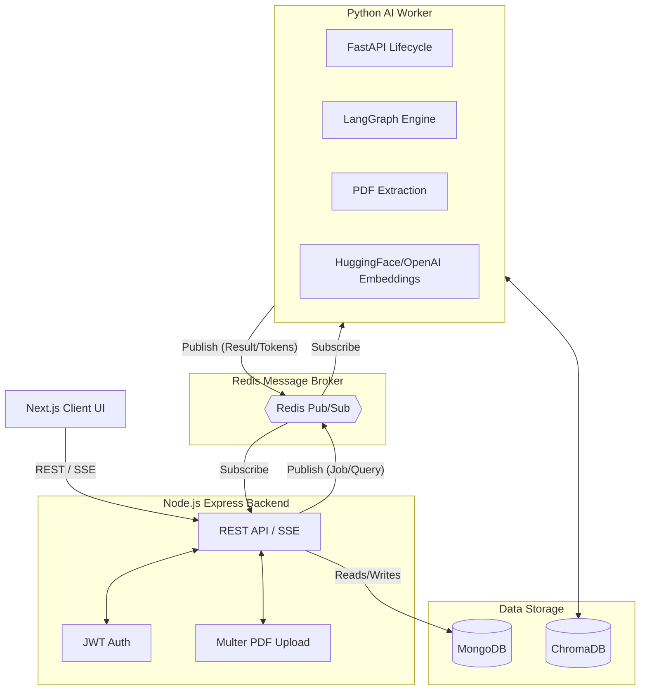
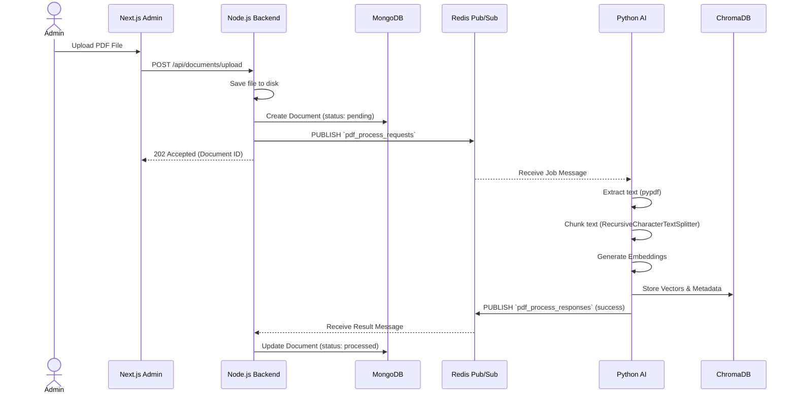
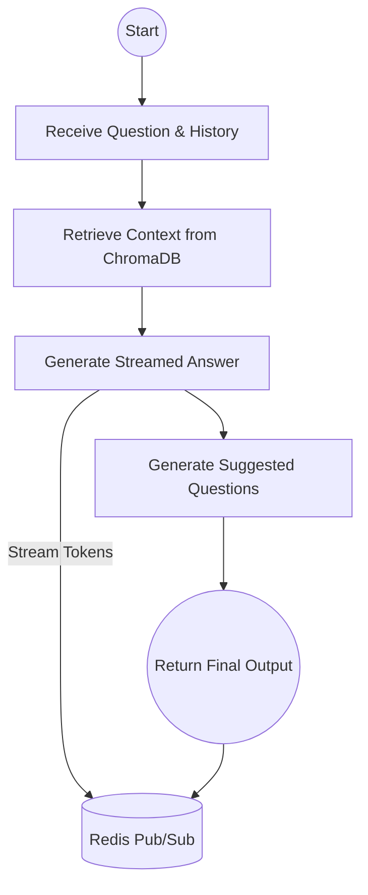

# 🏛️ System Architecture

This document outlines the high-level architecture, the AI agent workflow, the message broker contracts, and the database schemas for the PDF Knowledge Base AI Chatbot.

## 1. High-Level System Architecture

The application is split into distinct microservices. The Node.js backend handles traditional API duties, while a Python worker handles heavy AI tasks. **All communication between the backend and AI worker happens asynchronously via Redis Pub/Sub.**



## 2. PDF Ingestion Sequence

When an admin uploads a PDF, the file is saved locally (or to cloud storage), and an asynchronous job is dispatched to process it into the vector database.



## 3. LangGraph RAG Workflow

When a user asks a question, the Python service utilizes a LangGraph `StateGraph` to orchestrate the Retrieval-Augmented Generation process.



## 4. Redis Pub/Sub Contract

Direct HTTP communication between the Node.js backend and Python AI service is **strictly prohibited**. The following Redis channels define their interaction.

### Document Processing
- **Channel**: `pdf_process_requests` (Backend → AI)
  ```json
  {
    "requestId": "uuid-string",
    "documentId": "mongo-document-id",
    "filePath": "uploads/document.pdf",
    "fileName": "document.pdf",
    "vectorCollectionId": "uuid-string"
  }
  ```
- **Channel**: `pdf_process_responses` (AI → Backend)
  ```json
  {
    "requestId": "uuid-string",
    "status": "success | failed",
    "chunks": 42,
    "error": "Error message if failed"
  }
  ```

### Chat Answering (Streaming)
- **Channel**: `question_requests` (Backend → AI)
  ```json
  {
    "requestId": "uuid-string",
    "sessionId": "browser-session-id",
    "question": "What is the policy?",
    "history": [
      { "question": "Previous Q", "answer": "Previous A" }
    ]
  }
  ```
- **Channel**: `question_responses` (AI → Backend)
  *(Tokens are streamed as they are generated by the LLM)*
  ```json
  {"requestId": "uuid-string", "type": "chunk", "token": "The"}
  {"requestId": "uuid-string", "type": "chunk", "token": " answer"}
  {"requestId": "uuid-string", "type": "final", "answer": "The answer...", "sources": [{"documentName": "doc.pdf", "page": 1}], "suggestedQuestions": ["Q1?", "Q2?"]}
  ```

## 5. Database Schema

### MongoDB: `users`
| Field | Type | Description |
|-------|------|-------------|
| `_id` | ObjectId | Primary Key |
| `email` | String | Unique identifier |
| `password` | String | bcrypt hashed password |
| `role` | String | e.g., `"admin"` |
| `createdAt`| Date | Record creation timestamp |

### MongoDB: `knowledgedocuments`
| Field | Type | Description |
|-------|------|-------------|
| `_id` | ObjectId | Primary Key |
| `fileName` | String | Unique filename stored on disk |
| `originalName` | String | Original filename from user upload |
| `filePath` | String | Relative path on server storage |
| `fileSize` | Number | Size in bytes |
| `uploadDate` | Date | Timestamp of upload |
| `processingStatus`| String | `pending` \| `processing` \| `processed` \| `failed` |
| `chunkCount` | Number | Total vector chunks stored in ChromaDB |
| `errorMessage` | String | Populated if `processingStatus` is `failed` |
| `vectorCollectionId`| String | Metadata UUID used to scope/filter vectors in ChromaDB |

### MongoDB: `chats`
| Field | Type | Description |
|-------|------|-------------|
| `_id` | ObjectId | Primary Key |
| `sessionId` | String | Groups conversation turns by client session |
| `question` | String | User's prompt |
| `answer` | String | AI's final generated answer |
| `sources` | Array of Objects | `[{ documentName: String, page: Number }]` |
| `suggestedQuestions`| Array of Strings | Contextual follow-up questions generated by AI |
| `timestamp` | Date | Timestamp of the interaction |
